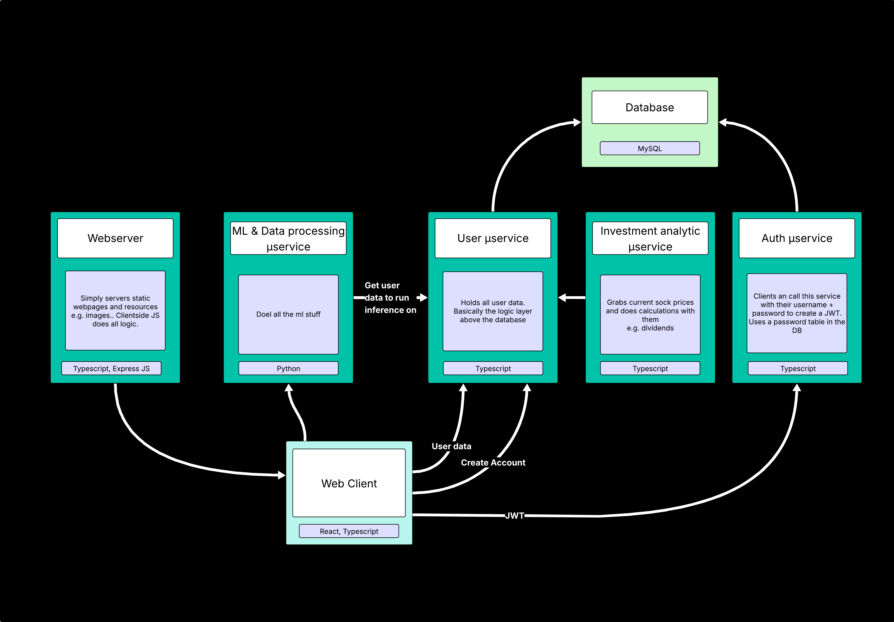

# About
a
Our project provides users with basic personal financial tracking and analytics via a web-based dashboard. 

We target users past the age of 16, who are looking to gain better awareness of their financial situation. Our UI prioritizes intuitive design and meaningful analytics.

# Getting started

#### Installation
Our project is completely dockerized, so our sole dependency is docker. 

Our microservices are located in `app/server`.
run `docker compose up` in this directory to start run the backend. 

The webserver is located in `app/client`. The same command starts the webserver.

#### Usage
Once you have both ends of the project running you can access the website via http://localhost. 

# Architecture
Finus was designed with a microservice architecture. 
You can find each service in the `app/server/services` folder. 

#### More
You can read more about our project's features and goals [here](documentation/product_vision.md).
